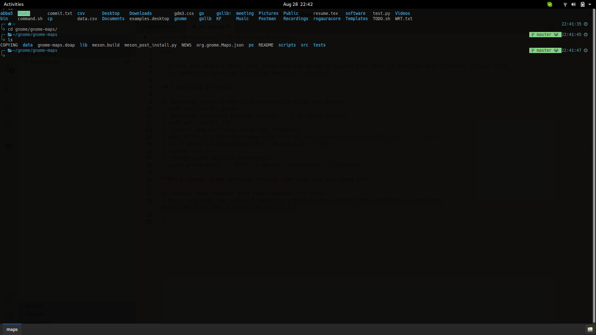

# Terminal:~$ 
 

**If you are reading this, that means you are going to speand your most of the time with terminal in your life.**  
**So, make your terminal beautiful and your friendly.**

## I am using oh-my-zsh

 

## Do want to customize Terminal? follow this setps...

0. Download guake (Guake is a top-down terminal for Gnome)
> sudo apt install guake

1. Download zsh using package manager. ( I am using Ubuntu)
> sudo apt install zsh

2. Install and configure Oh-my-zsh framework
> wget https://github.com/robbyrussell/oh-my-zsh/raw/master/tools/install.sh -O - | zsh \
> cp ~/.oh-my-zsh/templates/zshrc.zsh-template ~/.zshrc \
> source ~/.zshrc

3. Change guake default interpreter.
> guake preferences -> Shell -> default interpreter -> /bin/zsh

**Don't change gnome terminal setting some time you will need that.**

4. Install zsh-autosuggestions
> git clone https://github.com/zsh-users/zsh-autosuggestions ${ZSH_CUSTOM:-~/.oh-my-zsh/custom}/plugins/zsh-autosuggestions \
 gedit ~/.zshrc \
   * _Add the plugin to the list of plugins_
> plugins=(\
&nbsp;&nbsp;&nbsp;&nbsp;git\
&nbsp;&nbsp;&nbsp;&nbsp;zsh-autosuggestions\
)
* source zshrc file
> source ~/.zshrc

5. Install Hack Regular Nerd Font Complete.ttf fonts
> https://github.com/ryanoasis/nerd-fonts/blob/master/patched-fonts/Hack/Regular/complete/Hack%20Regular%20Nerd%20Font%20Complete.ttf

6. install powerlevel9k theam
> git clone https://github.com/bhilburn/powerlevel9k.git ~/.oh-my-zsh/custom/themes/powerlevel9k 

* Now copy and paste this code in ~/.zshrc file
* comment current # ZSH_THEME="robbyrussell" and paste this code bellow it.

~~~
ZSH_THEME="powerlevel9k/powerlevel9k"

POWERLEVEL9K_MODE='nerdfont-complete'
#POWERLEVEL9K_SHORTEN_DIR_LENGTH=1
#POWERLEVEL9K_SHORTEN_DELIMITER=""
#POWERLEVEL9K_SHORTEN_STRATEGY="truncate_from_right"
POWERLEVEL9K_PROMPT_ON_NEWLINE=true
POWERLEVEL9K_LEFT_SEGMENT_SEPARATOR=''
POWERLEVEL9K_RIGHT_SEGMENT_SEPARATOR=''
POWERLEVEL9K_LEFT_SUBSEGMENT_SEPARATOR=''
POWERLEVEL9K_RIGHT_SUBSEGMENT_SEPARATOR=''
POWERLEVEL9K_MULTILINE_FIRST_PROMPT_PREFIX="%F{blue}\u256D\u2500%F{white}"
POWERLEVEL9K_MULTILINE_LAST_PROMPT_PREFIX="%F{blue}\u2570\uf460%F{white} "
POWERLEVEL9K_LEFT_PROMPT_ELEMENTS=(root_indicator dir dir_writable_joined)
POWERLEVEL9K_RIGHT_PROMPT_ELEMENTS=(command_execution_time
                                    vcs background_jobs_joined time_joined)
POWERLEVEL9K_VCS_MODIFIED_BACKGROUND="clear"
POWERLEVEL9K_VCS_UNTRACKED_BACKGROUND="clear"
POWERLEVEL9K_VCS_MODIFIED_FOREGROUND="yellow"
POWERLEVEL9K_VCS_UNTRACKED_FOREGROUND="yellow"
POWERLEVEL9K_DIR_HOME_BACKGROUND="clear"
POWERLEVEL9K_DIR_HOME_FOREGROUND="blue"
POWERLEVEL9K_DIR_HOME_SUBFOLDER_BACKGROUND="clear"
POWERLEVEL9K_DIR_HOME_SUBFOLDER_FOREGROUND="blue"
POWERLEVEL9K_DIR_WRITABLE_FORBIDDEN_BACKGROUND="clear"
POWERLEVEL9K_DIR_WRITABLE_FORBIDDEN_FOREGROUND="red"
POWERLEVEL9K_DIR_DEFAULT_BACKGROUND="clear"
POWERLEVEL9K_DIR_DEFAULT_FOREGROUND="white"
POWERLEVEL9K_ROOT_INDICATOR_BACKGROUND="red"
POWERLEVEL9K_ROOT_INDICATOR_FOREGROUND="white"
POWERLEVEL9K_STATUS_OK_BACKGROUND="clear"
POWERLEVEL9K_STATUS_OK_FOREGROUND="green"
POWERLEVEL9K_STATUS_ERROR_BACKGROUND="clear"
POWERLEVEL9K_STATUS_ERROR_FOREGROUND="red"
POWERLEVEL9K_TIME_BACKGROUND="clear"
POWERLEVEL9K_TIME_FOREGROUND="cyan"
POWERLEVEL9K_COMMAND_EXECUTION_TIME_BACKGROUND='clear'
POWERLEVEL9K_COMMAND_EXECUTION_TIME_FOREGROUND='magenta'
POWERLEVEL9K_BACKGROUND_JOBS_BACKGROUND='clear'
POWERLEVEL9K_BACKGROUND_JOBS_FOREGROUND='green' 
~~~

* source zshrc file
> source ~/.zshrc

7. If you find difficulties in git.
> git config --global pager.branch false \
git config --global pager.diff false

## Your Shell is ready and it will increase your productivity. 